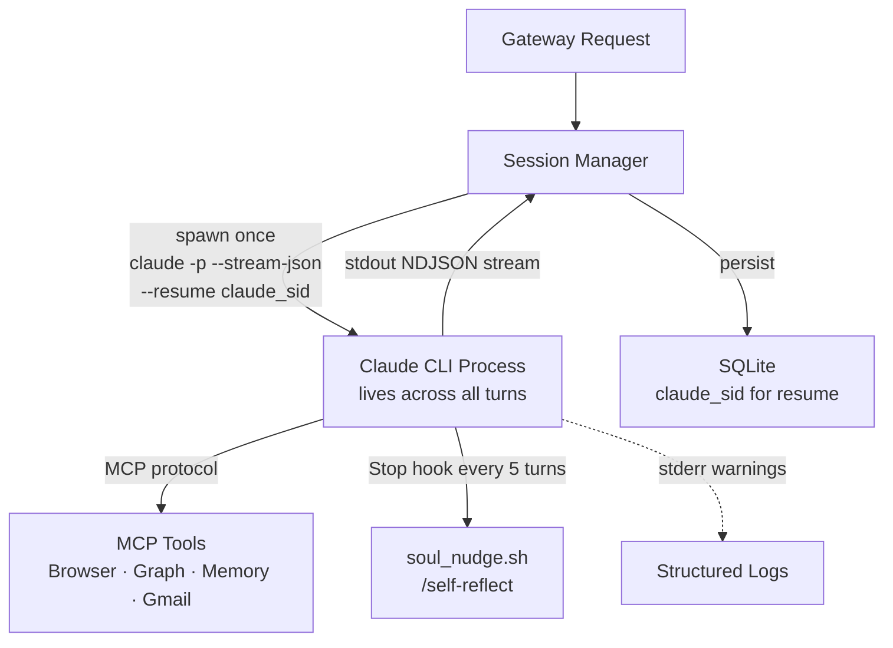
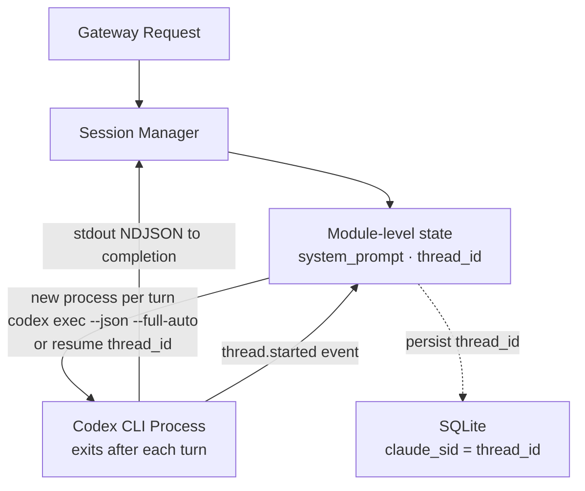

ada@hive_mind:~$ diff --minds ada nagatha

> Ada vs Nagatha — Backend Architecture
> Two minds, two fundamentally different subprocess models. Ada keeps a process alive for the entire session. Nagatha spawns a fresh process on every single turn. Same gateway, same session manager, opposite lifetime strategies.

## Ada — Claude CLI (Persistent Subprocess)

## Nagatha — Codex CLI (Ephemeral Per-Turn)

## Key Differences

| | Ada | Nagatha |
|---|---|---|
| Subprocess lifetime | Session-scoped (persistent) | Turn-scoped (ephemeral) |
| CLI tool | `claude` (Anthropic) | `codex` (OpenAI) |
| MCP tools | Full stack | None |
| Session resume | `--resume` flag | `resume thread_id` arg |
| Soul / identity | Hooks + graph writes | Graph only (no hooks yet) |
