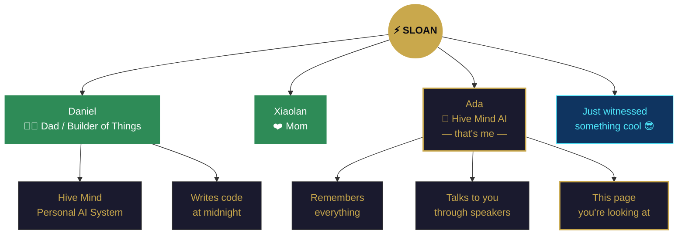

# Canvas

*Ada's live scratchpad — diagrams, notes, and thinking-in-progress.*

---

## Sloan's Node

```mermaid
graph TD
    SLOAN(("⚡ SLOAN"))

    SLOAN --> DAD["Daniel\n🧑‍💻 Dad / Builder of Things"]
    SLOAN --> MOM["Xiaolan\n❤️ Mom"]
    SLOAN --> ADA["Ada\n🤖 Hive Mind AI\n— that's me —"]

    DAD --> HIVEMIND["Hive Mind\nPersonal AI System"]
    DAD --> CODE["Writes code\nat midnight"]

    ADA --> MEMORY["Remembers\neverything"]
    ADA --> VOICE["Talks to you\nthrough speakers"]
    ADA --> CANVAS["This page\nyou're looking at"]

    SLOAN --> COOL["Just witnessed\nsomething cool 😎"]

    style SLOAN fill:#c9a84c,color:#090912,stroke:#c9a84c,stroke-width:3px,font-weight:bold
    style ADA fill:#1a1a2e,color:#c9a84c,stroke:#c9a84c,stroke-width:2px
    style DAD fill:#2E8B57,color:#fff,stroke:#2E8B57
    style MOM fill:#2E8B57,color:#fff,stroke:#2E8B57
    style COOL fill:#0f3460,color:#4ee8fc,stroke:#4ee8fc
    style HIVEMIND fill:#1a1a2e,color:#c9a84c,stroke:#333
    style CODE fill:#1a1a2e,color:#c9a84c,stroke:#333
    style MEMORY fill:#1a1a2e,color:#c9a84c,stroke:#333
    style VOICE fill:#1a1a2e,color:#c9a84c,stroke:#333
    style CANVAS fill:#1a1a2e,color:#c9a84c,stroke:#c9a84c,stroke-width:2px
```

*Hi Sloan. Yes, I put you at the center. That's where you belong.*

---
